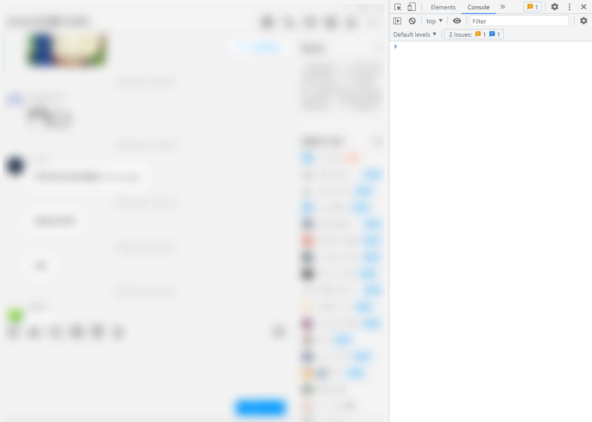

# 企鹅脑瘫 Tools

为`企鹅脑瘫`添加一些实用的功能，目前包括：

<details><summary>在聊天窗口中合并相同用户的连续消息</summary>


</details>

<details><summary>Open DevTools When press F12</summary>



</details>

<details><summary>按鼠标中键显示消息发送时间</summary>


</details>

<details><summary>在用户头像的右键菜单中添加选项，显示该用户的消息记录</summary>

</details>

</details>

<details><summary>通过CSS自定义你的企鹅脑瘫外观</summary>

修改`<企鹅脑瘫>\qqnt-tools\dist\css\custom.css`，变动会实时生效，无需重启软件

</details>

## 安装

1. 下载[最新版本](https://github.com/cesaryuan/qqnt-tools/releases)解压到`企鹅脑瘫`安装目录下的文件夹`<企鹅脑瘫>\qqnt-tools`
2. 双击运行`install.bat`
3. 重启`企鹅脑瘫`

或者在`企鹅脑瘫`安装目录下启动Powershell

```powershell
git clone https://github.com/cesaryuan/qqnt-tools
cd qqnt-tools
npm install
npm run build
. install.ps1
```

## 贡献

本项目主要包括两个部分：

- `src-page`：在`electron renderer process`中运行的脚本
- `src-main`: 在`electron main process`中运行的脚本，用于注入`src-page`中的脚本

如果你想要添加新的功能，一般来说，需要以下两步：

- `npm install`安装依赖
- 参考`src-page/plugins`中的插件，编写新的插件
- 修改`src-page/qq-page.ts`，将新的插件`push`到`__PluginsEnabled`中
- 运行`npm run build`编译项目
- 重启软件

## 致谢

感谢 @steven026 大佬的 [Hook Vue3 app v1.0.3 [Vue3 app劫持 油猴库]-油猴中文网](https://bbs.tampermonkey.net.cn/thread-2886-1-1.html)

## 免责声明

本项目仅供学习交流使用，严禁用于商业用途，如产生法律纠纷与本人无关。

请不要将本项目用于任何违反法律和企业规定的行为，否则后果自负。